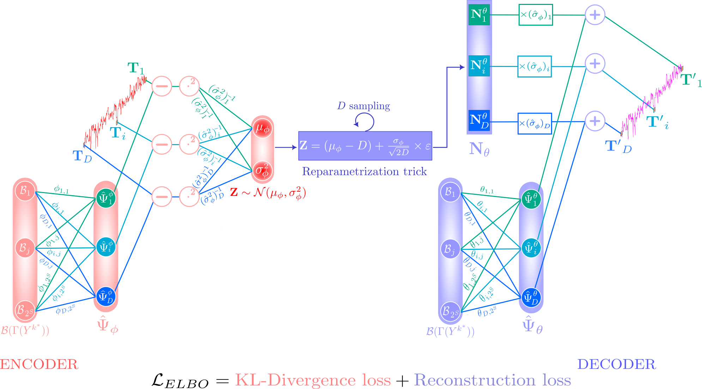

# Optimal Dimensionality Reduction using Conditional Variational AutoEncoder

<a id="readme-top"></a>

This Git repository is associated with the article *Optimal Dimensionality Reduction using Conditional Variational AutoEncoder* available on [TCHES website](https://tches.iacr.org/index.php/TCHES/article/view/12214) .

<!-- Table of contents -->
<details>
  <summary>Table of contents</summary>
  <ol>
    <li>
      <a href="#content-of-the-repository">Content of the repository</a>
      <ul>
        <li><a href="#context">Context</a></li>
        <li><a href="#implementation-tricks">Implementation tricks</a></li>
        <li><a href="#repository-structure">Repository structure</a></li>
      </ul>
    </li>
    <li>
      <a href="#getting-started">Getting Started</a>
      <ul>
        <li><a href="#prerequisites">Prerequisites</a></li>
        <li><a href="#installation">Installation</a></li>
      </ul>
    </li>
    <li><a href="#citation">Citation</a></li>
    <li><a href="#references">References</a></li>
  </ol>
</details>

## Content of the repository

### Context
We provide in this repository cVAE-OSM implementation and notebooks allowing to re-execute simulations and attacks conducted in our article. 

It should be noted for *Attack.ipynb* notebook that the attack scenario is conducted on simulated traces because we do not provided in this repository the datasets we attacked for environmental reasons, as they are publicly available. 

They can be downloaded here:

- **DPA contest v4.2**: https://dpacontest.telecom-paris.fr/v2 
- **AES_HD_Ext**: https://github.com/AISyLab/AES_HD_Ext 
- **ASCAD v1-F**: https://github.com/ANSSI-FR/ASCAD/blob/master/ATMEGA_AES_v1/ATM_AES_v1_fixed_key
- **ASCAD v1-R**: https://github.com/ANSSI-FR/ASCAD/blob/master/ATMEGA_AES_v1/ATM_AES_v1_variable_key
- **SCANTRU**: https://github.com/ANSSI-FR/scantru

Moreover, we draw users' attention to the fact that, to ensure proper attack execution, lines 133 and 139 in *attack.py* file must also be adapted to the targeted dataset.

We developed our model in Python 3.11.8, using Tensorflow [AAB+15] and Keras [C+15] libraries. 

### Implementation tricks

We point out that when implementing cVAE-OSM, a particular attention had to be paid to initialization of encoder weights characterizing $\boldsymbol{\Sigma_\phi}$. 
Indeed, since these weights represent estimated variances at each sample of traces, we initialize all weights characterizing $\boldsymbol{\Sigma_\phi}$ to 1 and add a custom constraint that forces weights during cVAE-OSM training to be always positive.
It is important to take this specificity into account during implementation to ensure proper autoencoder working. 
We thus consider this type of initialization and update for $\boldsymbol{\Sigma_\phi}$. 
We do not investigate impact of initialization and weights constraints on cVAE-OSM, especially on its weights convergence. 
This investigation should be part of a future work. 

Since we consider that the basis used to describe the deterministic part $\Psi$ includes a bias term and that the optimal dimensionality reduction does not involve it (see Theorem 2), we implement our model in such a way as to remove biases included in dense layers. 

Finally, as a relationship between the variance $\boldsymbol{\sigma^2_\phi}$ and mean $\boldsymbol{\mu_\phi}$ of monovariate traces $\mathbf{\tilde{T}}$ is defined *i.e.* $\boldsymbol{\mu_\phi}$ (resp. $\boldsymbol{\sigma^2_\phi}$) must converge towards $D$ (resp. $2D$) (see Section 3.3), we decide to create a custom dense layer for $\boldsymbol{\sigma^2_\phi}$ computation.
It consists in estimating the weights related to $\boldsymbol{\mu_\phi}$ and then, use those estimations to compute $\boldsymbol{\sigma^2_\phi}$ instead of re-estimating them.
Considering $D$ as the dimension of traces, this trick therefore reduces the number of trainable parameters by $D$ compared with the expected theoretical complexity defined in Section 3.3 (paragraph Neural network complexity).
Hence, this allows us to achieve the final architecture complexity presented in Proposition 1.

<a id="cvae-picture"></a>
<p align="center">
  <a href=""></a>
</p>
<p align="center">cVAE-OSM architecture.</p>

### Repository structure

Our repository has the following structure:
```bash
.
|   Attack.ipynb
|   cvae_picture.svg
|   Experiment_1.ipynb
|   Experiment_2.ipynb
|   Experiment_3.ipynb
|   Experiment_4.ipynb
|   poetry.lock
|   pyproject.toml
|   requirements.txt
|
└── cvae_osm_utils
        attack.py
        cVAE_OSM_model.py
        cVAE_OSM_tools.py
        experiments_tools.py
        generate_traces.py
        Kernel_Weights_Constraints.py
        __init__.py       
```
This repository contains 5 notebooks, 3 files, a picture and a package which includes 6 modules.

In the following, we briefly summarize the contents of each file.

As previously explained, these notebooks allow users to re-execute simulations and attacks conducted in Section 5.
- *Attack.ipynb* is a notebook in which we carry out profiled attacks using cVAE-OSM and following stategy provided in Section 4.2.
- *cvae_picture.svg* is a <a href="#cvae-picture">picture of cVAE-OSM architecture</a>.
- *Experiment_1.ipynb* allow users to reproduce the experiment on simulations about leakage model and variance extraction that is depicted in Section 5.1.2.
- *Experiment_2.ipynb* reproduces the experiment on simulations provided in Section 5.1.3, which is about the optimal dimensionality reduction performed by cVAE-OSM.
- *Experiment_3.ipynb* reproduces the experiment carried out in Section 5.1.4, which assess cVAE-OSM ability to overcome Small Sample Size (SSS) or High-Dimension Low Sample Size (HDLSS) problem.
- *Experiment_4.ipynb* includes all experiences depicted in Section 5.1.5, about the practical issues. 
- *poetry.lock*, *pyproject.toml* and *requirements.txt* files are described in Section <a href="#getting-started">Getting started</a>.

In addition, we provide a package called $`\texttt{cvae\_osm\_utils}`$ that contains modules necessary for notebooks running.

- *attack.py* implements the profiled attack strategy introduced in Section 4.2.
- *cVAE_OSM_model.py* implements cVAE-OSM model.
- *cVAE_OSM_tools.py* includes all auxiliary functions that can be useful when using cVAE-OSM such as weights visualization function or projection onto the Guilley *et al.* orthonormal basis [GHMR17] that is used in the paper. 
- *experiments_tools.py* includes all functions necessary to reproduce our experiments on simulations. 
- *generate_traces.py* implements a trace generation function.
- *Kernel_Weights_Constraints.py* implements custom weights constraint explained in <a href="#implementation-tricks">Implementation tricks</a> section.
- *\_\_init\_\_.py* empty file required to create our $`\texttt{cvae\_osm\_utils}`$ package.

<p align="right">(<a href="#readme-top">back to top</a>)</p>

## Getting started


### Prerequisites

To enforce experiment reproducibility, we suggest the use of poetry tool (https://python-poetry.org/).
We also provide a `requirements.txt` file to reproduce the Python environment used to perform experiments with `pip install`.

In case both solutions are not suited (impossibility of using a virtual environment) we alternatively provide a list of dependencies with no version information.
In this later case there is a high probability of not being able to reproduce the same results and/or being forced to adapt part of the code.

To use the solution based on Poetry it must be installed following the [install instructions](https://python-poetry.org/docs/#installation).

### Installation

#### Using Poetry

From the git root directory (where this readme file is), run

    poetry install
    
It will use the `poetry.lock` file to replicate the environment used for the paper.

> **Troubleshooting.**
>
> In case of failure, just remove this `poetry.lock` file, the resolution will be made by poetry based on information inside the `pyproject.toml`.
>
> If it still does not work, then move to the next setup option.

If the installation succeeded, you can now launch the virtual environment using the command:

    poetry shell

Note that you can alternatively source the `activate` file from the environment.

#### Using `requirements.txt`

If you are not able to install/run Poetry without error, then you can create a new virtual environment with the classical `python` command:

    python -m venv .venv

Then activate the environment and install the dependencies:

    source .venv/bin/activate
    pip install -r requirements.txt

#### Using Dependency List

The packages required for running the notebooks are:
  - tensorflow,
  - scipy,
  - numpy,
  - scikit-learn,
  - matplotlib,
  - ipykernel.

If none of the previous method is suited to your particular situation you can try to install these packages by the method of your choice and run the scripts.

For convenience, we provide the pip command below.

    pip install tensorflow scipy numpy scikit-learn matplotlib ipykernel

> Warning! The reproducibility of the results is then not guaranteed.

<p align="right">(<a href="#readme-top">back to top</a>)</p>

## Citation

If you use our code, model or wish to refer to our results, please use the following BibTex entry:
```
@article{Boussam_Carbone_Gérard_Renault_Zaid_2025,
title={Optimal Dimensionality Reduction using Conditional Variational AutoEncoder},
volume={2025},
url={https://tches.iacr.org/index.php/TCHES/article/view/12214},
DOI={10.46586/tches.v2025.i3.164-211},
abstractNote={The benefits of using Deep Learning techniques to enhance side-channel attacks performances have been demonstrated over recent years. Most of the work carried out since then focuses on discriminative models. However, one of their major limitations is the lack of theoretical results. Indeed, this lack of theoretical results, especially concerning the choice of neural network architecture to consider or the loss to prioritize to build an optimal model, can be problematic for both attackers and evaluators. Recently, Zaid et al. addressed this problem by proposing a generative model that bridges conventional profiled attacks and deep learning techniques, thus providing a model that is both explicable and interpretable. Nevertheless the proposed model has several limitations. Indeed, the architecture is too complex, higher-order attacks cannot be mounted and desynchronization is not handled by this model. In this paper, we address the first limitation namely the architecture complexity, as without a simpler model, the other limitations cannot be treated properly. To do so, we propose a new generative model that relies on solid theoretical results. This model is based on conditional variational autoencoder and converges towards the optimal statistical model i.e. it performs an optimal attack. By building on and extending the state-of-the-art theoretical works on dimensionality reduction, we integrate into this neural network an optimal dimensionality reduction i.e. a dimensionality reduction that is achieved without any loss of information. This results in a gain of O(D), with D the dimension of traces, compared to Zaid et al. neural network in terms of architecture complexity, while at the same time enhancing the explainability and interpretability. In addition, we propose a new attack strategy based on our neural network, which reduces the attack complexity of generative models from O(N) to O(1), with N the number of generated traces. We validate all our theoretical results experimentally using extensive simulations and various publicly available datasets covering symmetric, asymmetric pre and post-quantum cryptography implementations.},
number={3},
journal={IACR Transactions on Cryptographic Hardware and Embedded Systems},
author={Boussam, Sana and Carbone, Mathieu and Gérard, Benoît and Renault, Guénaël and Zaid, Gabriel},
year={2025},
month={Jun.},
pages={164–211} }
```

<p align="right">(<a href="#readme-top">back to top</a>)</p>

## References

[AAB+15] Martín Abadi, Ashish Agarwal, Paul Barham, Eugene Brevdo, Zhifeng Chen, Craig Citro, Greg S. Corrado, Andy Davis, Jeffrey Dean, Matthieu Devin, Sanjay Ghemawat, Ian Goodfellow, Andrew Harp, Geoffrey Irving, Michael Isard, Yangqing Jia, Rafal Jozefowicz, Lukasz Kaiser, Manjunath Kudlur, Josh Levenberg, Dandelion Mané, Rajat Monga, Sherry Moore, Derek Murray, Chris Olah, Mike Schuster, Jonathon Shlens, Benoit Steiner, Ilya Sutskever, Kunal Talwar, Paul Tucker, Vincent Vanhoucke, Vijay Vasudevan, Fernanda Viégas, Oriol Vinyals, Pete Warden, Martin Wattenberg, Martin Wicke, Yuan Yu, and Xiaoqiang Zheng. TensorFlow: Large-scale machine learning on heterogeneous systems, 2015. Software available from tensorflow.org.

[C+15] François Chollet et al. Keras. https://keras.io, 2015.

[GHMR17]  Sylvain Guilley, Annelie Heuser, Tang Ming, and Olivier Rioul. Stochastic side-channel leakage analysis via orthonormal decomposition. In Innovative Security Solutions for Information Technology and Communications: 10th International Conference, SecITC 2017, Bucharest, Romania, June 8–9, 2017, Revised Selected Papers 10, pages 12–27. Springer, 2017.

<p align="right">(<a href="#readme-top">back to top</a>)</p>
